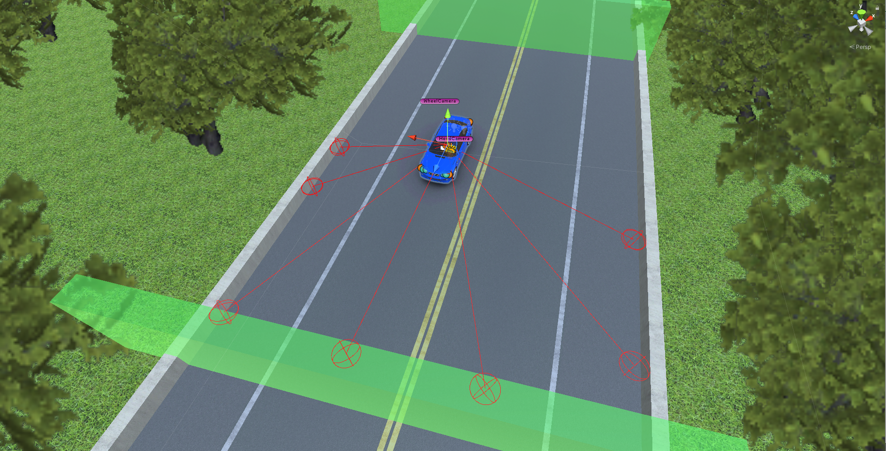

# physics_car_RL_AI
Reinforcement Learning AI for physics simulated car\
Using Wheel Colliders + Mesh Colliders and Unity built-in physics system\
I used **checkpoint method** for training 

Contents - 目次
- [Environment Setup - 環境の設定](#set-ups)
- [Method - 実現方法](#method)
- [Trained Result - 学習結果](#trained-result)

# Set-ups
**Training map**\
\
**Physics car with wheel collider**\

# Method
Agent shoots 7 rays. It will detect the distance to both the walls and checkpoints
\

# Trained Result
3x Speed\

