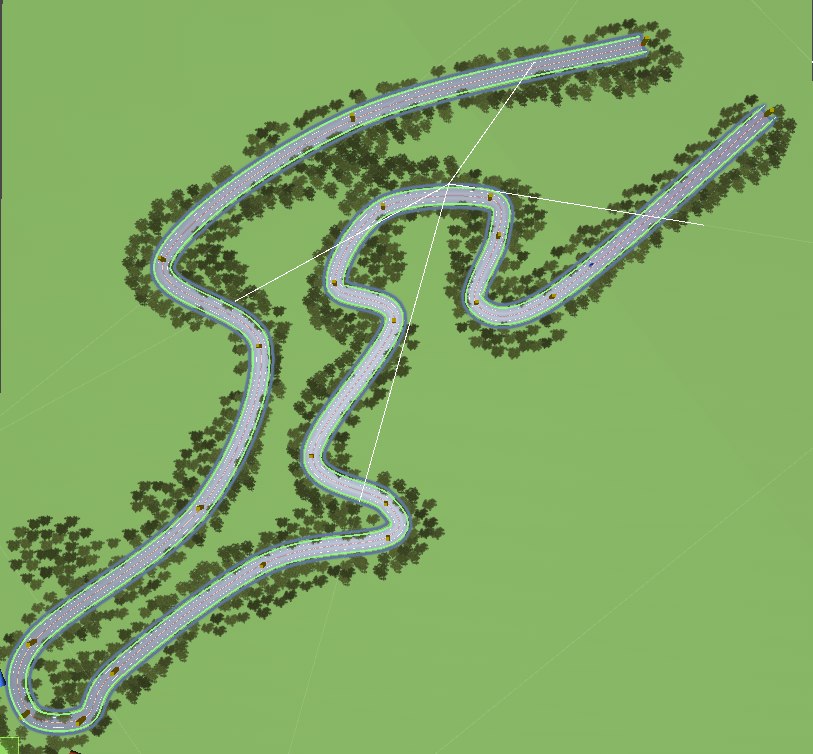
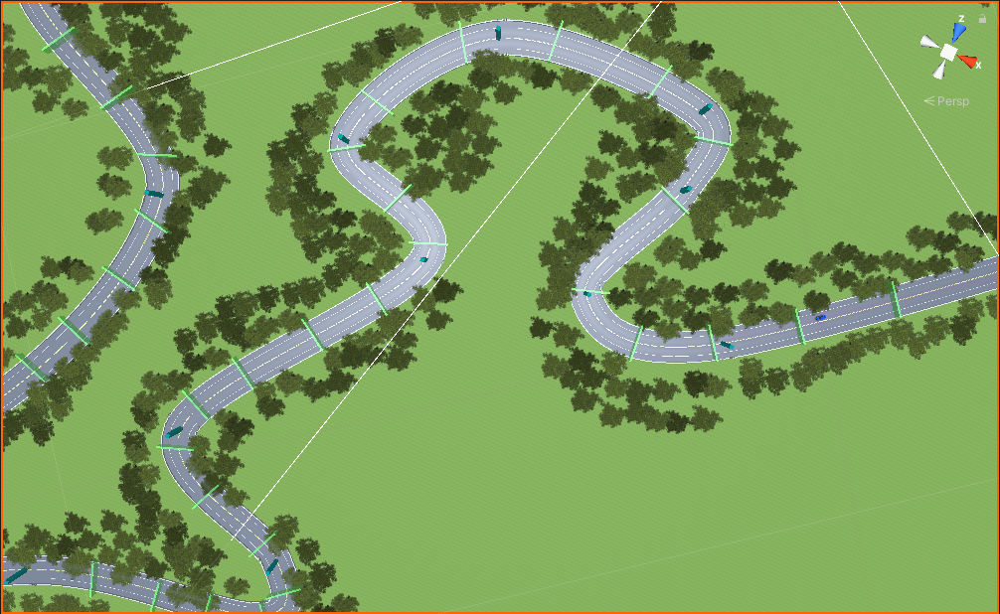

# physics_car_RL_AI
Reinforcement Learning AI for physics simulated car\
Using Wheel Colliders + Mesh Colliders and Unity built-in physics system\
I used **checkpoint method** for training 

### Checkpoint Method Environment
Setting a lot of checkpoint over the roads, the agent will learn how to reach the next checkpoint as fast as possible. \
Usually car will shoot rays to detect the distance between car and checkpoint plane\
**Advantages** : Easy to setup, fits any kinds of race track\
**Disadvantages** : You have to manually set up checkpoint planes for the track. It can be done automatically, however it may come some failure cases where you have to adjust by yourself. 

Contents - 目次
- [Environment Setup - 環境の設定](#set-ups)
- [Method - 実現方法](#method)
- [Trained Result - 学習結果](#trained-result)

# Set-ups
**Training map** and **Map with checkpoint setup**\
  \
**Physics car with wheel collider**\

# Method
Agent shoots 7 rays. It will detect the distance to both the walls and checkpoints\
**Reward** is porpotional to the distance to the checkpoint\
\

# Trained Result
3x Speed\

